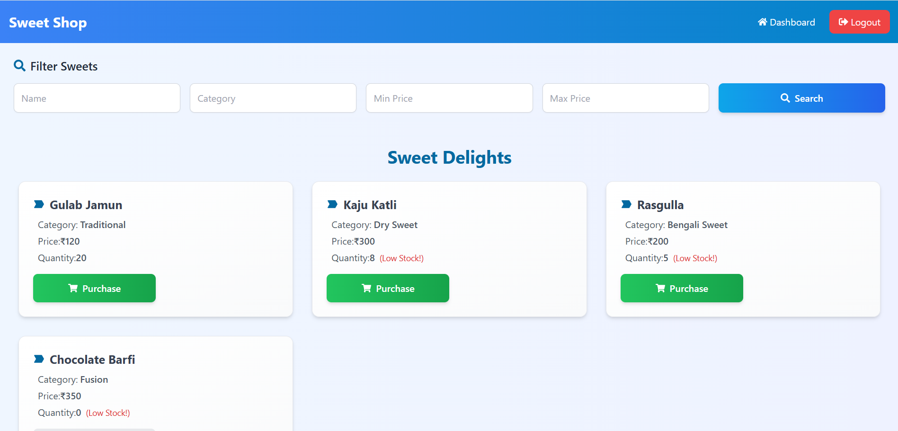
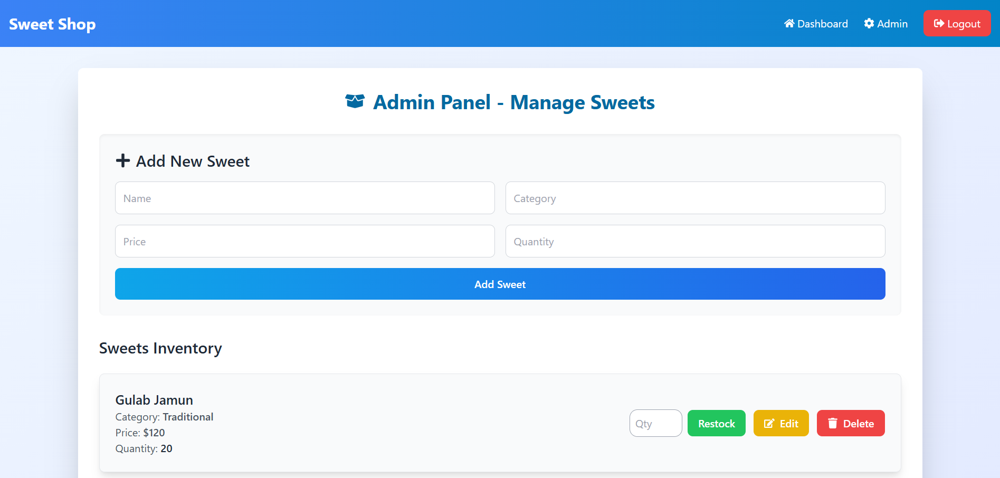
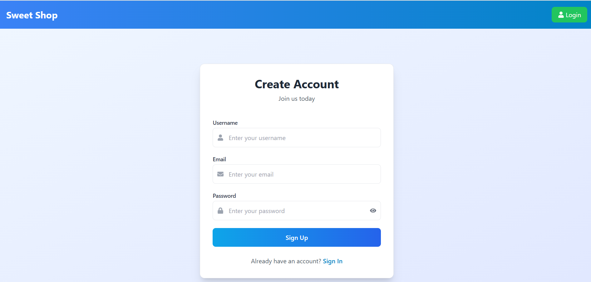

<h1> Sweet Shop Management System </h1>

 &nbsp;  &nbsp;  &nbsp; 

A full-stack web application for managing a sweet shop, allowing users to browse, search, and purchase sweets, while providing administrators with tools to manage inventory, add/edit sweets, and restock items.

<h2>🚀Features</h2>

**• User Dashboard:** Browse and search sweets by name, category, and price range.

**• Admin Panel:** Add, edit, delete, and restock sweets with a user-friendly interface.

**• Authentication:** Secure login system with role-based access (user/admin).

**• Search & Filter:** Advanced filtering options for sweets.

**• Responsive Design:** Mobile-friendly UI built with Tailwind CSS.

**• Real-time Updates:** Dynamic inventory management with API integration.

<h2>🛠️ Technologies Used</h2>

**Frontend**:
React.js, React Router for navigation, Tailwind CSS for styling, Axios for API calls, React Icons for UI elements

**Backend**: 
Node.js with Express.js, MongoDB for database, JWT for authentication, RESTful API endpoints

<h2>⚡Installation and Setup</h2>

**Prerequisites**
Node.js (v14 or higher), npm or yarn, MongoDB (local or cloud instance)

**Backend Setup**:

1.Clone the repository:
   - `git clone https://github.com/your-username/sweet-shop.git`
   - `cd sweet-shop/backend`

2.Install dependencies:   
   - `npm install`

3.Run the backend server:   
   - `npm start`   

**Frontend Setup**:

1.Navigate to the frontend directory:
   - `cd ../frontend`

2.Install dependencies:   
   - `npm install`

3.Run the frontend application:      
   - `npm start` (The app will open in your browser at http://localhost:5173; ensure backend is running for API calls).

<h2>📸 Screenshots</h2>  

1. 

   
2. 

3. 

<h2>🤖 My AI Usage</h2>

**AI Tools Used**

1. Ghatgpt: Primary AI assistant for code generation, and debugging and testing.
2. Gemini: UI Improvements

**How I Used Them**

1. Code Generation: I primarily used Chatgpt for boilerplate code generation in the React components
2. UI Enhancements: Gemini helped refine Tailwind CSS classes for better styling, including gradients, shadows, and responsive layouts and suggest icons. 
3. Problem Solving: When encountering issues like undefined props (e.g., onSearch in SearchBar), I consulted chatgpt for solutions, such as making components self-contained or refactoring into separate files. 
4. Testing using AI: I used ChatGPT to help design and implement automated tests for the backend. This ensured that all functionalities worked correctly, and I also manually verified dashboard entries for accuracy.

**Reflection on AI Impact**

AI significantly accelerated my development workflow by providing quick, high-quality code snippets and design suggestions, allowing me to focus on logic and integration rather than boilerplate.However, I always reviewed and customized the generated code to ensure it fit my project's needs.

<h2>📧 Contact</h2>

*Email* : aditinageshwar7@gmail.com
*LinkedIn* : https://www.linkedin.com/in/aditinageshwar/